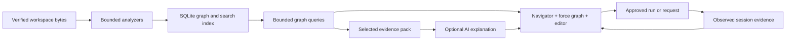

# Aone IDE

[](https://github.com/abthesuccessor/aone-ide/actions/workflows/ci.yml)
[](LICENSE)
[](docs/DEVELOPMENT.md)
[](https://tauri.app)

Aone is a local-first desktop workbench for understanding human-written and
AI-written software. It connects indexed source and document structure, bounded
graph views, API paths, run output, and evidence-backed explanations without
requiring a graph server or an AI provider.

This repository contains source and tests for a macOS-focused proof of concept.
That is not proof that an application is installed, packaged, notarized,
deployed, or connected to a live project.

Original AONE code is licensed under the [MIT License](LICENSE). AONE is the
project attribution selected by its owner, Amra; it does not currently identify
an incorporated company. Dependencies and adapted material retain their own
terms: see [third-party notices](THIRD_PARTY_NOTICES.md). The
[publication readiness review](docs/OPEN_SOURCE_READINESS.md) records remaining
ownership/provenance, security, and release checks.

For setup and supported platforms, start with
[Development](docs/DEVELOPMENT.md). For changes, see [Contributing](CONTRIBUTING.md).

Graphify informed parts of the navigation and code-knowledge workflow, but Aone
is an independent implementation over Rust, SQLite, React, Monaco, and D3. It
does not embed a Graphify runtime, depend on Graphify, or copy Graphify source.

## Core model

Aone keeps four questions in one workbench:

1. **What exists?** A bounded local index records files, code declarations,
   imports, calls, HTTP operations, datastore hints, events, and supported
   document structure.
2. **How is it connected?** Purpose-specific queries return bounded graph
   snapshots for an overview, neighborhood, execution flow, or search.
3. **Where is the proof?** Navigable facts retain a relative file path and an
   exact Monaco range when the parser can supply one.
4. **What actually happened?** Only admitted trace/debug envelopes and approved
   local API activity become observed evidence. Static analysis and AI text do
   not silently become runtime truth.



Rust owns filesystem, process, network, consent, and persistent-state authority.
React owns presentation and interaction. SQLite is the canonical local store
for structural facts; search indexes and graph snapshots are rebuildable
projections. AI is an optional interpreter of already selected evidence, not a
parser, permission system, or source of record.

## Source capabilities

The current source includes:

- native folder selection, bounded scanning, incremental indexing, and a local
  SQLite graph/search store;
- code extraction for TypeScript, JavaScript, Rust, Python, Go, Java, C#, C++,
  and Kotlin, with language-specific semantic depth;
- exact heading and sentence facts for Markdown, MDX, TXT, RST, and AsciiDoc;
- a left Knowledge Navigator for paged API paths and indexed files;
- a D3 force-directed relationship graph with selection, pan, zoom, drag, Fit,
  graph search, structural-community metadata, and exact source navigation;
- current-view export as `graph.json`, `GRAPH_REPORT.md`, and `graph.html`;
- editable Monaco tabs with contained, hash-checked saves and formatting;
- workspace search backed by bounded FTS candidates and verified source reads;
- backend-detected run profiles launched by explicit Run/Debug actions, a
  cooperative instrumented debugger, a consented local OTLP receiver, a bounded
  xterm PTY, local Git inspection/mutations, and
  permissioned project/tool setup;
- one Project Agent workspace that restores the last approved local inspection,
  separates engineer work from IDE-safe actions, answers bounded setup questions,
  and asks before selecting a registered run profile;
- explicit-action/native-confirmed HTTP and native-approved WebSocket clients
  with value-free retained metadata;
- optional hosted, loopback Ollama, or audited Codex CLI explanations over a
  bounded selected graph corridor; and
- an OpenAPI 3.1 description of the Tauri command payloads plus an AsyncAPI
  description of backend-originated application events.

Opening, scanning, indexing, searching, graph navigation, source navigation,
and export work without AI. The setup dialog offers **Continue code-only**.
Configuring an AI transport does not send workspace evidence; each explanation
requires a separate explicit request and native consent.

## Code and document facts

Code analyzers can emit files, declarations, imports, calls, HTTP routes,
API/datastore hints, and statically named events. Their evidence remains
`declared`, `resolved`, or `inferred` according to how the relationship was
established.

Document extraction is intentionally structural and exact:

| Input | Extracted nodes | Extracted edges |
| --- | --- | --- |
| `.md`, `.mdx` | ATX/Setext headings and sentences | `contains`, `precedes` |
| `.rst` | underline-style headings and sentences | `contains`, `precedes` |
| `.adoc`, `.asciidoc` | `=` headings and sentences | `contains`, `precedes` |
| `.txt` | sentences | `precedes` |

Document nodes and edges are `declared`; they do not receive invented confidence
values. Source locations use one-based Monaco UTF-16 columns with exclusive end
positions. Markdown backtick/tilde fences and AsciiDoc `[source]` delimited
blocks are skipped so embedded examples are not reported as prose. Discovery
stops at 250,000 lines or the shared 5,000-fact per-file ceiling and records the
corresponding truncation reason.

Document file metadata identifies `parser=aone-document`, `parserVersion=1`,
format, visited lines, considered segments, extracted facts, and truncation.
`analysisTruncationReasons` distinguishes `document line limit reached` from
`document fact limit reached`. Segment metadata includes content hash and
document order; headings also retain level and style.

Binary PDFs, images, audio, video, and other binary media are not parsed by this
pipeline and are not automatically uploaded. Safe indexed UTF-8 text remains
subject to the workspace exclusions and size ceilings documented in
[Security](SECURITY.md).

## Bounded graph behavior

The center workbench renders the active snapshot as a D3 force graph. The force
simulation affects only presentation; it never changes node identity, evidence,
or community membership. The separate cooperative debugger uses its own
deterministic, API-scoped path inside a four-pane trace workbench; it does not
reuse the force simulation.

Graph search is a bounded backend query, not a browser-only filter. The renderer
accepts one control-free query of at most 256 characters and requests a
depth-two neighborhood capped at 500 nodes. Backend graph queries also bound
depth, result size, node-kind filters, and edge-kind filters. A `truncated`
result means the returned snapshot is not the whole workspace graph.

Every returned graph snapshot receives deterministic structural communities.
The bounded algorithm treats returned edges as undirected, deduplicates them,
ignores dangling edges, and gives isolates singleton communities. Nodes expose:

| Metadata | Meaning |
| --- | --- |
| `communityId` | Stable `community:<32 hex>` identifier for this structure |
| `communitySize` | Member count in the returned snapshot |
| `communityAlgorithm` | `deterministicLabelPropagationV1` |
| `communityBasis` | `boundedGraphSnapshot` |
| `communityComplete` | `false` when the snapshot is truncated |

These are deterministic structural groupings of the current bounded snapshot,
not semantic topics, teams, services, or runtime-discovered clusters.

## Knowledge Navigator and graph export

The Knowledge Navigator stays mounted in the graph activity view and exposes:

- **API call paths**, loaded from deterministic cursor pages, with endpoint,
  handler, service, repository/DAO/model relationships and `file:line` links;
- **Indexed files**, with a bounded tree and complete-index path search; and
- endpoint tracing and graph-node selection synchronized with the source editor.

The API tree and graph never manufacture a complete end-to-end path. Missing
or inferred links remain visibly missing or inferred.

**Export current graph view** downloads three renderer-created artifacts:

- `graph.json` — the machine-readable bounded snapshot and artifact metadata;
- `GRAPH_REPORT.md` — a readable evidence, hub, limitation, and community report;
- `graph.html` — a standalone offline viewer for the same serialized snapshot.

An export represents only the current bounded view, including its truncation
state. It is not a dump of the complete index. The standalone viewer makes no
network request, but relative paths, labels, and metadata can still be sensitive
and should be reviewed before sharing.

## Evidence and optional AI

| Evidence | Meaning |
| --- | --- |
| `declared` | Directly present in indexed source or supported text structure |
| `resolved` | Deterministically linked by analysis |
| `inferred` | Heuristic/static correlation or AI interpretation |
| `observed` | Admitted during an approved local run or request |

For a selected graph node, the renderer constructs a deterministic undirected
two-hop corridor from the active bounded snapshot. It sends at most 16 selected
node IDs. Rust rebuilds a provider-safe evidence pack containing those nodes
and eligible edges between them, with a total ceiling of 24 evidence items and
32 KiB. Every call uses a Rust-owned fixed task and requires native consent.

Discourse relationships in an AI explanation are inferred unless the supplied
evidence already declares or observes that relationship. An explanation never
upgrades graph evidence, proves runtime behavior, or gains filesystem/process
authority. Credentials and evidence contents are omitted from the consent
dialog, and only one AI call may be pending or active.

## Project Agent and AI transports

The initial dialog supports an authenticated Codex CLI or Claude Code CLI,
direct OpenAI or Anthropic API access held only in native process memory,
loopback Ollama, or a code-only workflow. GitHub Copilot CLI is not currently a
supported transport.

Each CLI adapter is discovered only in a fixed set of install locations, must
resolve to a native executable, is version-checked, and is re-verified
immediately before every run. Claude Code is invoked with every ambient
capability switched off — no built-in tools, skills, MCP servers, settings
files, or persisted session — and a hard spend ceiling per call. See
[the AI feature notes](src-tauri/src/ai/README.md) for the exact contract.

Project Agent combines the former Project Setup and Setup Agent navigation into
one **Readiness → Plan → Ask** surface. Reopening it silently restores only the
latest report already approved for the current app-session workspace; only
**Inspect** or **Inspect again** can start a new two-stage native inspection.
Recommendations cite deterministic project evidence and may select only a
backend-registered run profile after approval. Each free-text Project Agent
question is bounded, redacted, report-bound, and separately confirmed before it
reaches the configured provider. AI text never executes a command.

Package installation, environment-file creation, migrations, Docker startup,
and dependency-service orchestration remain manual until each action has a
reviewed native adapter and its own approval. A Dockerfile alone is packaging
evidence, not proof that Docker is the correct way to run a project.

If Run or Debug is requested before a usable profile exists, Aone opens Project
Agent instead of guessing a command or starting dependencies.

## Run from source

Requirements:

- macOS 15.0 or later with the Xcode command-line tools (Apple Silicon is the
  primary development target; see the platform matrix in Development);
- Node.js 24.18.0 and npm 12.0.1, using `package-lock.json`; and
- Rust 1.97.0, pinned in `rust-toolchain.toml` with rustfmt and Clippy.

```bash
npm ci
npm run check
npm run desktop
```

For browser-only layout development:

```bash
npm run dev
```

The browser demo cannot provide native filesystem, process, consent, terminal,
OTLP, or debugger authority.

## Validate the source tree

```bash
npm run structure
npm run openapi:check
npm run asyncapi:check
npm run build
npm test
npm run lint:rust
npm run test:rust
```

These commands validate their respective source, contract, build, lint, and test
layers. Passing them does not by itself prove packaging, signing, installation,
notarization, deployment, or behavior against a live external project.

## Current limitations

Aone is not a VS Code distribution and has no extension host. Static analysis
cannot prove arbitrary runtime flow; deep function/SQL/async evidence requires
explicit instrumentation, an admitted OTLP span, or a future debugger adapter.
The cooperative debugger is not DAP and cannot stop arbitrary source lines.
The source includes no remote Git mutation, saved API collection, MCP runtime,
automatic tool installer, or binary-document understanding.

Running an opened project requires that project's own local toolchain. Aone does
not bundle Node.js, Python, Java, .NET, Go, or project dependencies.

## Further reading

- [Graphify-inspired workbench](docs/GRAPHIFY_WORKBENCH.md)
- [Architecture](docs/ARCHITECTURE.md)
- [IPC contract](docs/IPC_CONTRACT.md)
- [v0.1 acceptance criteria](docs/V0_1_ACCEPTANCE.md)
- [Roadmap](docs/ROADMAP.md)
- [Security](SECURITY.md)

## Design references

- [Graphify](https://github.com/Graphify-Labs/graphify) informed API-first
  navigation, clickable source evidence, progressive graph disclosure, and the
  distinction between extracted and inferred links. Aone independently
  reimplemented those ideas and uses no Graphify runtime or source.
- [VS Code workbench](https://code.visualstudio.com/docs/configure/custom-layout)
  informed the title bar, activity bar, side bars, editor, panel, and status bar
  anatomy; Aone implements that layout in its own React/Tauri application.
- [shadcn resizable](https://ui.shadcn.com/docs/components/base/resizable)
  informed the accessible panel composition.
- [Tauri v2 IPC](https://v2.tauri.app/concept/inter-process-communication/)
  provides the desktop authority boundary.

See [Reference review](docs/REFERENCE_REVIEW.md) for the detailed adopted and
rejected patterns.
